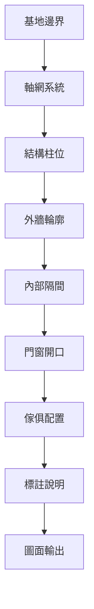

# CAD_API 開發中 - 未來功能路線圖

## 願景

將 CAD_API 從簡單的繪圖工具轉變為智能建築設計助手，從住宅建築開始。

---

## 第一階段：核心繪圖功能

### 1.1 基礎繪圖命令

#### 高頻率使用（⭐⭐⭐⭐⭐）- 建築繪圖必備
| 命令 | 用途 | 建築繪圖實例 |
|------|------|--------------|
| **Offset** | 偏移複製 | 繪製牆體厚度（240mm承重牆、120mm隔間牆） |
| **Trim/Extend** | 修剪/延伸 | 調整牆線相交、門窗開口處理 |
| **Copy** | 複製 | 複製標準房間配置、門窗、柱位 |
| **Move** | 移動 | 調整房間位置、傢俱配置 |
| **Mirror** | 鏡射 | 對稱平面設計（如雙併住宅） |
| **Fillet** | 圓角 | 牆角倒圓、管道轉彎 |
| **Layer** | 圖層管理 | 分離建築、結構、機電圖層 |
| **Block/Insert** | 圖塊 | 門窗、傢俱、設備符號庫 |
| **Array** | 陣列 | 樓梯踏步、停車位、柱列 |
| **Rotate** | 旋轉 | 調整傢俱方向、斜向配置 |
| **Scale** | 縮放 | 圖面比例調整、符號大小 |
| **Hatch** | 填充 | 材質表現（磁磚、木紋、混凝土） |
| **Dimension** | 標註 | 尺寸標註系統 |
| **Text/MText** | 文字 | 房間名稱、說明文字 |
| **Region** | 面域 | 計算面積、布林運算 |

#### 中頻率使用（⭐⭐⭐）- 特定用途
| 命令 | 用途 | 建築繪圖實例 |
|------|------|--------------|
| **Break** | 打斷 | 斷開線段插入符號 |
| **Join** | 合併 | 連接斷開的牆線 |
| **Pedit** | 聚合線編輯 | 編輯複雜輪廓線 |


#### 低頻率使用（⭐⭐）- 特殊情況
| 命令 | 用途 | 建築繪圖實例 |
|------|------|--------------|
| **Polygon** | 多邊形 | 六角形空間、特殊平面 |
| **Ellipse** | 橢圓 | 橢圓形會議桌、裝飾元素 |
| **Spline** | 雲形線 | 曲線牆面、景觀設計 |
| **Point** | 點 | 標記特定位置、座標點 |
| **Divide/Measure** | 等分/定距 | 均分立面開窗、欄杆間距 |
| **Chamfer** | 倒角 | 45度牆角、斜切處理 |
| **Wipeout** | 覆蓋 | 遮蔽下層圖面 |
| **Table** | 表格 | 門窗表、材料表 |
| **Align** | 對齊 | 對齊參考線、軸線 |

#### 建築標準圖層結構
```
A-WALL          # 牆體
A-WALL-FULL     # 承重牆
A-WALL-PART     # 隔間牆
A-DOOR          # 門
A-WIND          # 窗
A-GLAZ          # 玻璃
A-FLOR          # 樓板
A-CLNG          # 天花板
A-STRS          # 樓梯
A-ELEV          # 電梯
A-FURN          # 傢俱
A-PLNT          # 植栽
A-ANNO          # 標註
A-ANNO-DIMS     # 尺寸
A-ANNO-TEXT     # 文字
A-ANNO-SYMB     # 符號
S-COLS          # 結構柱
S-BEAM          # 結構樑
S-GRID          # 軸線
M-HVAC          # 空調
M-PLMB          # 給排水
E-POWR          # 電力
E-LITE          # 照明
```
### 1.5 建築繪圖工作流程



---

## 第二階段：建築專案結構

### 2.1 專案目錄結構
```
draw/
└── projects/                         # 專案根目錄
    └── {專案名稱}/                  # 個別專案
        ├── project.json             # 專案配置文件
        ├── site_info.json           # 基地資訊
        ├── regulations.json         # 法規限制
        ├── requirements.json        # 屋主需求
        ├── floors/                  # 樓層資料
        │   ├── B1.json             # 地下一樓
        │   ├── 1F.json             # 一樓
        │   ├── 2F.json             # 二樓
        │   └── RF.json             # 屋頂層
        └── drawings/                # 圖檔輸出
            ├── floor_plans/         # 平面圖
            ├── elevations/          # 立面圖
            └── sections/            # 剖面圖
```

### 2.2 基地資訊 (site_info.json)
```json
{
  "site_boundary": {
    "coordinates": [[x1,y1], [x2,y2], ...],  // 基地邊界座標
    "area": 200,                             // 基地面積 (平方公尺)
    "orientation": "N"                       // 方位
  },
  "setbacks": {                              // 退縮距離
    "front": 4.0,
    "rear": 3.0,
    "left": 1.5,
    "right": 1.5
  },
  "context": {
    "road_width": 8.0,                       // 道路寬度
    "adjacent_buildings": []                 // 鄰房資訊
  }
}
```

### 2.3 法規限制 (regulations.json)
```json
{
  "building_coverage_ratio": 0.6,            // 建蔽率
  "floor_area_ratio": 2.4,                  // 容積率
  "max_height": 14.0,                       // 最大高度 (公尺)
  "max_floors": 4,                          // 最大樓層數
  "parking_requirements": {                  // 停車位需求
    "cars": 1,
    "motorcycles": 2
  },
  "fire_regulations": {                      // 消防法規
    "escape_routes": 2,
    "min_corridor_width": 1.2
  }
}
```

### 2.4 屋主需求 (requirements.json)
```json
{
  "family_members": 4,
  "lifestyle": ["在家工作", "經常招待客人"],
  "floor_requirements": {
    "1F": {
      "rooms": [
        {"type": "客廳", "min_area": 25},
        {"type": "廚房", "min_area": 15},
        {"type": "車庫", "cars": 1}
      ]
    },
    "2F": {
      "rooms": [
        {"type": "主臥室", "min_area": 20},
        {"type": "臥室", "count": 2, "min_area": 12},
        {"type": "衛浴", "count": 2}
      ]
    }
  },
  "special_requirements": [
    "南向採光",
    "主臥需要更衣室",
    "廚房需要中島"
  ]
}
```

---

## 第三階段：空間拓撲系統

### 3.1 房間定義
```json
{
  "room_id": "LR_1F_001",
  "type": "客廳",
  "floor": "1F",
  "boundary": {
    "coordinates": [[0,0], [5000,0], [5000,4000], [0,4000]],
    "area": 20.0,
    "perimeter": 18.0
  },
  "connections": [
    {"to": "KT_1F_001", "type": "開口", "width": 2000},
    {"to": "EN_1F_001", "type": "門", "width": 900}
  ],
  "windows": [
    {"wall": "南", "width": 3000, "height": 2100}
  ],
  "attributes": {
    "ceiling_height": 3000,
    "floor_material": "木地板",
    "natural_light": "良好"
  }
}
```

### 3.2 空間關係
- [ ] 鄰接矩陣
- [ ] 動線路徑
- [ ] 視覺連接
- [ ] 隱私等級

### 3.3 自動驗證
- [ ] 檢查建蔽率
- [ ] 檢查容積率
- [ ] 檢查退縮距離
- [ ] 檢查房間大小需求
- [ ] 檢查動線效率

---

## 第四階段：智能設計助手

### 4.1 自然語言介面
```
使用者: "在一樓配置一個25平方米的客廳，要有南向採光"
系統: 分析需求 → 找尋合適位置 → 生成房間 → 配置窗戶
```

### 4.2 設計建議
- [ ] 最佳房間配置
- [ ] 動線優化
- [ ] 自然採光分析
- [ ] 空間效率指標

### 4.3 生成式設計
- [ ] 多重配置選項
- [ ] 參數化變化
- [ ] 性能評分
- [ ] 學習使用者偏好

---

## 第五階段：進階功能

### 5.1 參數化設計系統（⭐⭐⭐⭐⭐ 高優先）
- [ ] **參數化牆體**
  - 牆體厚度、材質、高度的即時修改
  - 承重牆/隔間牆類型切換
  - 牆體連接與清理
- [ ] **參數化構件**
  - 柱、樑、樓板參數化定義
  - 尺寸與材質快速調整
  - 構件庫管理

### 5.2 智能門窗系統（⭐⭐⭐⭐⭐ 高優先）
- [ ] **門窗族庫**
  - 標準門窗樣式庫
  - 自定義門窗參數（寬度、高度、樣式）
  - 開啟方式設定（平開、推拉、固定）
- [ ] **智能插入**
  - 自動切割牆體
  - 門窗編號系統
  - 門窗表自動生成

### 5.3 面積計算系統（⭐⭐⭐⭐⭐ 高優先）
- [ ] **自動面積統計**
  - 建築面積計算
  - 使用面積計算
  - 公攤面積分析
- [ ] **房間面積標註**
  - 自動識別封閉區域
  - 面積標註與更新
  - Excel 報表輸出

### 5.4 專業圖紙功能（⭐⭐⭐⭐⭐ 高優先）
- [ ] **建築標註系統**
  - 建築尺寸標註樣式
  - 標高符號系統
  - 軸線與軸號
- [ ] **符號庫**
  - 建築符號（指北針、比例尺、圖例）
  - 材料圖例
  - 設備符號
- [ ] **圖框與圖簽**
  - 標準圖框模板
  - 圖簽自動填寫
  - 圖紙集管理

### 5.5 智能輔助設計（⭐⭐⭐⭐⭐ 高優先）
- [ ] **戶型模板庫**
  - 常用戶型模板
  - 房間模組化設計
  - 快速戶型生成
- [ ] **智能標註**
  - 自動尺寸標註
  - 標高自動計算
  - 軸線自動對齊
- [ ] **參數化樓梯**
  - 直跑、L型、U型樓梯
  - 踏步自動計算
  - 扶手與欄杆

### 5.6 MEP 整合功能（⭐⭐⭐⭐ 中優先）
- [ ] **基礎管線繪製**
  - 給排水管線
  - 電氣線路布置
  - 簡易暖通風管
- [ ] **設備布置**
  - 衛浴設備庫
  - 廚房設備庫
  - 空調設備定位
- [ ] **碰撞檢測**
  - 管線碰撞提示
  - 高度衝突檢查

### 5.7 工程量統計（⭐⭐⭐⭐ 中優先）
- [ ] **材料統計**
  - 門窗數量表
  - 牆體材料量
  - 地坪面積表
- [ ] **報表生成**
  - Excel 整合輸出
  - 自定義報表格式
  - 圖形化統計

### 5.8 暫不實現功能（標記為未來考慮）

#### 立面與剖面生成（需要3D引擎支援）
- ❌ 立面自動生成
- ❌ 剖面自動生成
- ❌ 立剖面編輯

#### 3D 建模與視覺化（需要專門3D引擎）
- ❌ 自動3D生成
- ❌ 樓層堆疊3D
- ❌ 即時3D預覽
- ❌ 渲染引擎

#### 智能識別與轉換（需要AI技術）
- ❌ 圖形識別
- ❌ 智能轉換
- ❌ 圖層自動映射

#### 協同設計功能（需要網路架構）
- ❌ 圖紙鎖定
- ❌ 版本控制
- ❌ 雲端協作

#### 規範檢查與優化（需要專業演算法）
- ❌ 日照分析
- ❌ 節能分析
- ❌ 疏散路徑分析

---

## 實施優先順序

### 立即 (v1.1)
1. 基本繪圖命令
2. 專案結構設置
3. 基地邊界定義

### 短期 (v1.2-1.5)
1. 房間創建與管理
2. 座標追蹤系統
3. 基本驗證檢查

### 中期 (v2.0)
1. 自然語言介面
2. 空間拓撲引擎
3. 設計優化

### 長期 (v3.0+)
1. 參數化設計系統
2. 智能門窗與面積計算
3. 專業圖紙功能
4. MEP 基礎整合

---

## 技術考量

### 資料結構
- 使用 JSON 儲存配置和資料
- 實施空間索引提高效率
- 支援復原/重做操作

### 架構
- 模組化插件系統
- 事件驅動命令處理
- 關注點分離

### 整合
- 支援 IFC 格式匯入/匯出
- 第三方擴充 API
- 雲端協作功能

---

## 成功指標

1. **效率**
   - 減少 50% 設計時間
   - 自動化重複任務

2. **品質**
   - 零法規違規
   - 優化空間利用

3. **易用性**
   - 自然語言命令
   - 直觀的專案管理

---

## 附錄：建築繪圖實例

### A. 繪製標準房間的命令序列

#### 範例1：繪製主臥室（4m x 5m）
```bash
# 1. 繪製房間外牆輪廓
DRAW RECTANGLE 0,0 4000,5000

# 2. 使用 OFFSET 創建 240mm 牆厚
OFFSET LAST -240  # 向內偏移創建內牆線

# 3. 創建門開口（900mm）
SELECT WINDOW 3500,0 4000,500
TRIM SELECTED    # 修剪出門開口

# 4. 插入門符號
INSERT DOOR_900 3550,0 90

# 5. 創建窗戶開口（1800mm）
SELECT WINDOW 1000,4800 2800,5000
TRIM SELECTED
INSERT WINDOW_1800 1900,4900 0

# 6. 添加房間標註
TEXT 2000,2500 250 "主臥室"
TEXT 1800,2200 180 "16.64 m²"
```

#### 範例2：廚房配置（含中島）
```bash
# 1. 基本廚房空間（3.5m x 4m）
DRAW RECTANGLE 0,0 3500,4000
OFFSET LAST -120  # 隔間牆 120mm

# 2. L型廚具
DRAW POLYLINE 120,120 120,2500 2000,2500
OFFSET LAST 600   # 廚具深度 600mm

# 3. 中島檯面
DRAW RECTANGLE 1500,1500 2700,2400
FILLET LAST 50    # 圓角處理

# 4. 插入設備圖塊
INSERT SINK 1000,2200 0
INSERT STOVE 500,1800 0
INSERT FRIDGE 2800,3500 -90
```

### B. 建築元素繪製技巧

#### 牆體系統
```bash
# 承重牆（240mm）
DRAW LINE 0,0 5000 H
OFFSET LAST 240
JOIN SELECTED  # 合併成聚合線

# T型牆相交
DRAW LINE 2500,0 2500,3000
OFFSET LAST 120
TRIM ALL       # 修剪相交處
FILLET ALL 0   # 清理轉角
```

#### 樓梯繪製
```bash
# 直跑樓梯（踏步280mm，級高175mm）
# 使用 ARRAY 快速生成
DRAW RECTANGLE 0,0 280,1200  # 單一踏步
ARRAY LAST RECTANGULAR 15 1 280 0  # 15級

# 或使用 DIVIDE
DRAW LINE 0,0 4200,0  # 總長4.2m
DIVIDE LAST 15        # 等分15段
```

#### 停車位陣列
```bash
# 標準車位 2.5m x 5m
DRAW RECTANGLE 0,0 2500,5000
ARRAY LAST RECTANGULAR 1 10 0 2600  # 橫向10個車位
```

### C. 高效工作流程

#### 1. 使用圖層分離元素
```bash
LAYER CREATE A-WALL
LAYER SET A-WALL
# 繪製所有牆體...

LAYER CREATE A-DOOR
LAYER SET A-DOOR
# 插入所有門...
```

#### 2. 圖塊庫管理
```bash
# 創建標準門圖塊
SELECT WINDOW 0,0 100,900
BLOCK SELECTED DOOR_900 50,0

# 批量插入
INSERT DOOR_900 1000,0 0
INSERT DOOR_900 3000,0 180
INSERT DOOR_900 5000,2000 90
```

#### 3. 對稱設計
```bash
# 雙併住宅鏡射
SELECT ALL
COPY SELECTED 0,0  # 先複製
MIRROR SELECTED 10000,0 10000,5000  # 沿中線鏡射
```

### D. 面積計算與驗證

```bash
# 使用 REGION 計算淨面積
SELECT TYPE POLYLINE
REGION SELECTED
# 顯示面積資訊

# 建蔽率檢查
# 建築面積 / 基地面積 ≤ 0.6
```

### E. 常見錯誤與解決

1. **牆線不閉合**
   - 使用 `JOIN` 連接斷開的線段
   - 使用 `PEDIT` 將線段轉為聚合線

2. **重疊線段**
   - 使用 `OVERKILL` 清除重複物件（待實現）

3. **圖塊比例錯誤**
   - 插入時指定正確比例
   - 使用 `SCALE` 調整現有圖塊

---

*本文檔是一個動態路線圖，將根據社群反饋和開發進度更新。*

最後更新: 2025-07-26

---

## 版本更新說明

### 2025-07-26 更新
- 新增專業建築CAD功能規劃（參考天正CAD T20）
- 重新分類功能優先級
- 將參數化設計、智能門窗、面積計算、專業圖紙、智能輔助設為高優先級
- 將3D視覺化、立面生成、智能識別、協同設計標記為暫不實現
- 新增MEP基礎整合與工程量統計功能